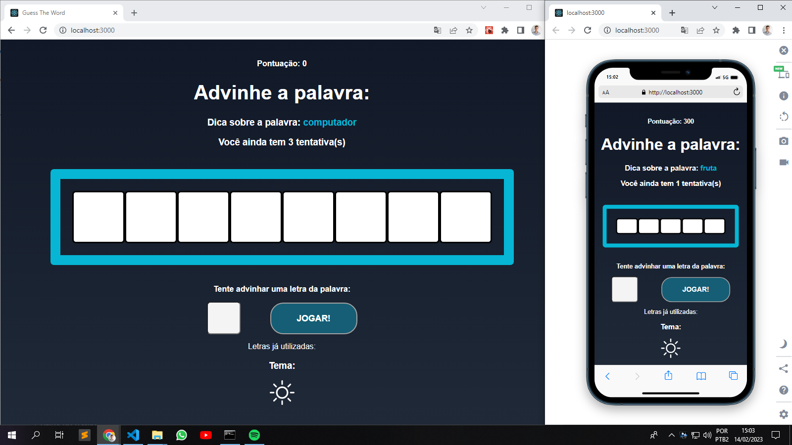

<p align='center'></p>

 <p align='center'>


 
</p>

## 🚀 Teste o jogo por conta própria:

## - [Deploy](https://guess-the-word-nine.vercel.app/)

## 🚀 Tecnologias
Esse projeto está utilizando as seguintes tecnologias:
    

- [React](https://pt-br.reactjs.org/)
- [Lottie](https://lottiefiles.com/)


## ⚙️ Como funciona?
- Seleciona categoria e palavra de forma aleatória
- Usuário possui 3 vidas
- Caso perca o usuario é levado para tela de GameOver
- Caso acerte uma nova palavra é escolhida

## 🎲 Quer customizar o projeto?
### Clone esse repositório
```bash
git clone https://github.com/Savio-Anjos/guess-the-word.git

```

### Navegue até o diretório do projeto
```bash 
cd guess-the-word
```

### Instale as dependências
```bash
npm i
```
```bash
yarn
```
### Inicie a aplicação 
```bash
yarn start
npm start
```

## 🖼️ Layout


---
<p>Criado com 💙 por <a href='https://github.com/Savio-Anjos/' target='_blank'>Sávio Anjos</a></p>